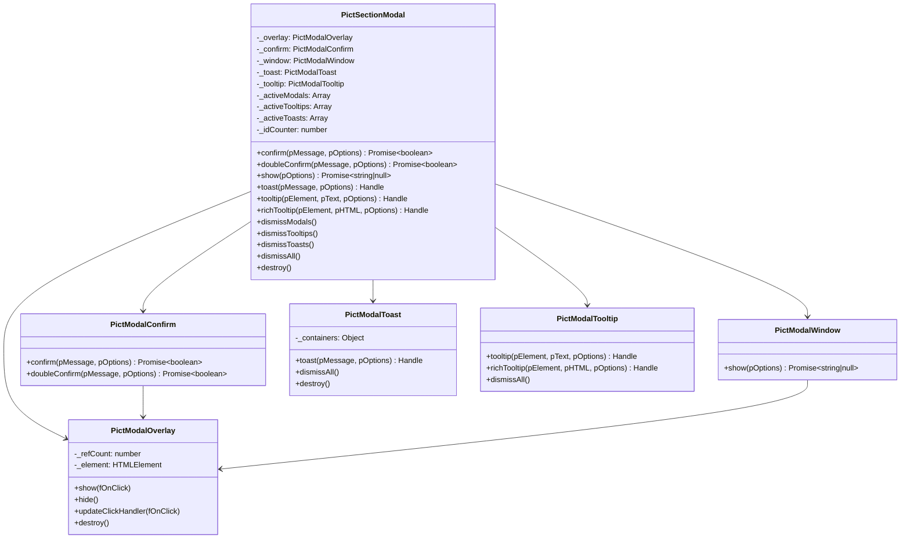

# Architecture

Pict-Section-Modal follows the standard Pict view pattern -- a single view class that extends `pict-view` and registers with a Fable instance through the service provider pattern. Internally, the view delegates to five helper classes, each responsible for a specific type of UI element.

## High-Level Design

<!-- bespoke diagram: edit diagrams/high-level-design.mmd or .hints.json, then: npx pict-renderer-graph build modules/pict/pict-section-modal/docs -->

## Class Relationships

## Overlay Management

The overlay is a semi-transparent backdrop that appears behind modal dialogs. It is reference-counted so that multiple stacked modals share a single overlay element.

<!-- bespoke diagram: edit diagrams/overlay-management.mmd or .hints.json, then: npx pict-renderer-graph build modules/pict/pict-section-modal/docs -->

When a modal is dismissed while others remain, the overlay updates its click handler to point to the new topmost modal. This ensures that clicking the backdrop always dismisses the correct dialog.

## Promise Pattern

Confirm dialogs and modal windows both use the same promise-based flow:

1. The application calls `confirm()`, `doubleConfirm()`, or `show()`
2. The helper builds a DOM element, appends it to `document.body`, and animates it in
3. The helper returns a `new Promise` whose resolver is wired to the button click handlers
4. When the user clicks a button (or the close button, or the overlay, or presses Escape), the resolver fires with the result
5. The dialog animates out and is removed from the DOM after the CSS transition completes

<!-- bespoke diagram: edit diagrams/promise-pattern.mmd or .hints.json, then: npx pict-renderer-graph build modules/pict/pict-section-modal/docs -->

## DOM Lifecycle

Every UI element follows the same create/animate/remove lifecycle:

1. **Create** -- `document.createElement()` builds the element with appropriate classes and attributes
2. **Append** -- The element is appended to `document.body` (or a toast container)
3. **Reflow** -- A forced reflow (`void element.offsetHeight`) ensures the browser registers the initial state
4. **Animate In** -- Adding the `pict-modal-visible` class triggers a CSS transition (opacity and transform)
5. **Interactive** -- The element is live and interactive
6. **Animate Out** -- Removing `pict-modal-visible` (or adding an exit class) triggers the reverse transition
7. **Remove** -- After a 220ms delay (matching the CSS transition duration), the element is removed from the DOM

This pattern ensures every element has a smooth entrance and exit animation, and no orphaned elements remain in the DOM after dismissal.

## z-index Layering

Elements use fixed z-index values to ensure correct stacking:

| Layer | z-index | Element |
|-------|---------|---------|
| Overlay | 1000 | `.pict-modal-overlay` -- Backdrop behind modals |
| Dialogs | 1010 | `.pict-modal-dialog` -- Confirm and modal windows |
| Tooltips | 1020 | `.pict-modal-tooltip` -- Hover tooltips |
| Toasts | 1030 | `.pict-modal-toast-container` -- Toast notification stacks |

Toasts have the highest z-index so they remain visible even when a modal dialog is open. Tooltips sit above dialogs because they may be triggered by elements inside a modal.

## CSS Theming Architecture

The theming system uses CSS custom properties (CSS variables) scoped to a root class:

<!-- bespoke diagram: edit diagrams/css-theming-architecture.mmd or .hints.json, then: npx pict-renderer-graph build modules/pict/pict-section-modal/docs -->

During initialization, the view adds the `pict-modal-root` class to `document.body`. All CSS rules reference variables defined on this class. To theme the module, override any `--pict-modal-*` variable in your own stylesheet -- no need to modify the module's source or increase specificity.

The variables are organized into groups:

| Group | Variables | Controls |
|-------|-----------|----------|
| Overlay | `--pict-modal-overlay-bg` | Backdrop color and opacity |
| Dialog | `--pict-modal-bg`, `--pict-modal-fg`, `--pict-modal-border`, `--pict-modal-shadow`, etc. | Dialog chrome appearance |
| Header | `--pict-modal-header-bg`, `--pict-modal-header-fg`, `--pict-modal-header-border` | Dialog title bar |
| Buttons | `--pict-modal-btn-*` | Button colors for default, primary, and danger styles |
| Toast | `--pict-modal-toast-*` | Toast background colors for each severity type |
| Tooltip | `--pict-modal-tooltip-*` | Tooltip background, text, and shadow |
| Typography | `--pict-modal-font-family`, `--pict-modal-font-size`, `--pict-modal-title-font-size` | Font settings |
| Animation | `--pict-modal-transition-duration` | Transition speed for all animations |

## Integration with Other Pict Views

Pict-Section-Modal is a standard Pict view, so it integrates with other views and services through the Fable instance. Common patterns:

- **Access from any view**: `this.pict.views['Pict-Section-Modal'].confirm('...')`
- **Use in form validation**: Call `confirm()` before submitting a pict-section-form
- **Show toasts from API responses**: Wire toast calls to Meadow REST response handlers
- **Tooltips on dynamic content**: Attach tooltips after another view renders its content

The view does not render into a container element -- it appends directly to `document.body`. This means it works alongside any other Pict section without layout conflicts.

## Design Patterns

### Delegation Pattern

The main `PictSectionModal` class is a thin facade. Each public method delegates to the appropriate helper class. This keeps each helper focused on a single UI concern while presenting a unified API to application code.

### Reference Counting

The overlay uses reference counting rather than a simple show/hide boolean. This correctly handles the case where multiple modals are open simultaneously -- the overlay stays visible until every modal has been dismissed.

### Handle Pattern

Toast notifications and tooltips return handle objects with `dismiss()` or `destroy()` methods. This gives the caller explicit control over the lifecycle of elements that might otherwise be managed only by timeouts or user interaction.

### Double-Dismiss Prevention

Every dialog and toast tracks a `_dismissed` flag. If a dismiss function is called twice (for example, by clicking the overlay and pressing Escape simultaneously), the second call is a no-op. This prevents race conditions in the animation and promise resolution logic.
